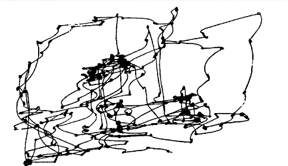
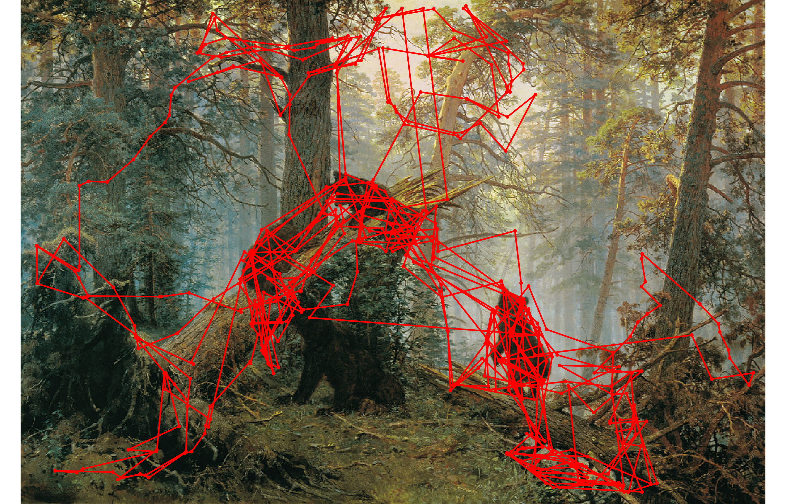
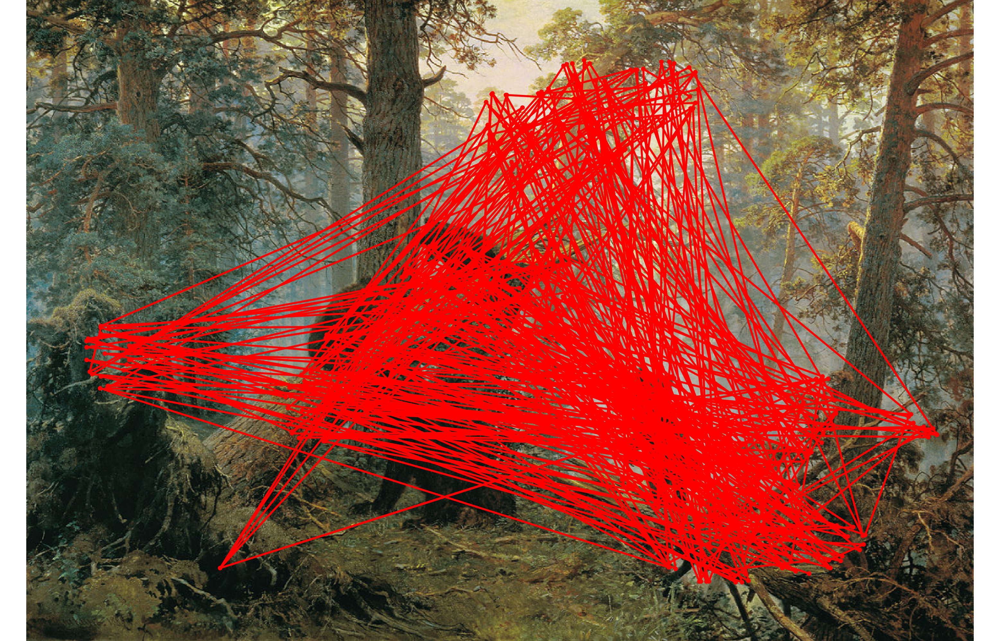

# STAR-FC Saccade Generator
#### (Selective Tuning Attentive Reference model - Fixation Control)

This repository contains C++ code for our CVPR 2018 paper ["Active Fixation Control to Predict Saccade Sequences"](http://openaccess.thecvf.com/content_cvpr_2018/html/Wloka_Active_Fixation_Control_CVPR_2018_paper.html). Python version of the code is under development and will be released soon.

### Usage

Given a single input image, STAR-FC will produce a sequence of fixation locations (a list of x,y coordinates).

### Example output
Qualitative results on images used in Yarbus' free-viewing experiments showing (from left to right) human fixations, fixations produced by STAR-FC and [SALICON](https://github.com/CLT29/OpenSALICON).
See our paper ["A Focus on Selection for Fixation"](https://bop.unibe.ch/index.php/JEMR/article/view/2710) for more examples.

<div>
    
    
    
</div>


### Citing us

If you find our work useful in your research, please consider citing:

```latex
@InProceedings{Wloka_CVPR18,
  author = {Wloka, Calden and Kotseruba, Iuliia and Tsotsos, J. K.},
  title = {Saccade Sequence Prediction: Beyond Static Saliency Maps},
  booktitle = {The IEEE Conference on Computer Vision and Pattern Recognition (CVPR)},
  month = {June},
  year = {2018}
}
```
- [INSTALLATION](#INSTALLATION)
- [Running STAR-FC](#running-star-fc)
- [Config File Format](#config-file-format)

## INSTALLATION
STAR-FC requires an NVIDIA GPU with at least 5GB of memory available (tested on Titan X and GeForce GTX 1080 Ti).

### Docker (strongly recommended)

Install [nvidia-docker](https://github.com/NVIDIA/nvidia-docker) following the instructions in the official repository.

Build Docker container using the scripts provided in docker_scripts folder (may take up to 1 hour to build OpenCV 3 with CUDA support and caffe with dependencies):

```
sh docker_scripts/build
```

### Building from source

In the following instructions `$STAR_FC_ROOT` refers to the location of STAR_FC root directory.

Clone STAR_FC repository.

Install dependencies via apt-get:

```
apt-get update && apt-get install \
build-essential \
autoconf \
automake \
libtool \
cmake \
curl \
libgtk2.0-dev \
pkg-config \
libavcodec-dev \
libavformat-dev \
libswscale-dev \
python3-pip \
python3-dev \
python3-setuptools \
python3-numpy \
libleveldb-dev \
libsnappy-dev \
libhdf5-serial-dev \
libgtest-dev \
libfftw3-dev \
libboost-all-dev \
libgoogle-glog-dev \
libgtest-dev \
libmatio-dev \
libatlas-base-dev \
liblmdb-dev \
libxext-dev \
libx11-dev \
x11proto-gl-dev \
dbus \
wget \
unzip \
dh-autoreconf \
```

```
pip3 install scikit-image
```
Download OpenCV 3.3 and build it with CUDA support enabled (necessary for running the AIM saliency algorithm in reasonable time).

```
wget -O opencv.zip https://github.com/opencv/opencv/archive/3.3.0.zip
unzip opencv.zip
mkdir opencv-3.3.0/build
cd opencv-3.3.0/build
cmake -DCMAKE_BUILD_TYPE=RELEASE \
   -DWITH_GTK=OFF -DWITH_GTK_2_X=OFF -DWITH_QT=ON \
   -DBUILD_JPEG=ON \
   -DCMAKE_INSTALL_PREFIX=/usr/local \
   -DINSTALL_PYTHON_EXAMPLES=OFF \
   -DINSTALL_C_EXAMPLES=OFF  \
   -DWITH_CUDA=ON \
   -DBUILD_EXAMPLES=OFF .. && make -j8 && make install
```

Install protobuf version 3.1 (other versions do not seem to work with SALICON):

```
wget -O protobuf.zip https://github.com/google/protobuf/archive/v3.1.0.zip
unzip protobuf.zip
cd protobuf-3.1.0
/autogen.sh
./configure
make
make install
ldconfig
```
```
pip3 install --user --upgrade protobuf==3.1.0
```

Install [CUDA 8.0](https://developer.nvidia.com/cuda-toolkit-archive), [CuDNN 5.0](https://developer.nvidia.com/rdp/cudnn-archive) for CUDA 8.0 ([installation instructions](http://docs.nvidia.com/deeplearning/sdk/cudnn-install/index.html)) and [Caffe](https://github.com/BVLC/caffe/wiki/Ubuntu-16.04-or-15.10-Installation-Guide).

Download and build caffe rc4 inside `$STAR_FC_ROOT/contrib/caffe`. Note: Caffe MUST be built with Python3 support, OpenCV 3.0 and CuDNN (see Makefile.config provided):

```
wget -O caffe.zip https://github.com/BVLC/caffe/archive/rc4.zip
unzip caffe.zip
mkdir -p $STAR_FC_ROOT/contrib/caffe
mv caffe-rc4/* $STAR_FC_ROOT/contrib/caffe/
cd $STAR_FC_ROOT/contrib/caffe/
make -j8 && make pycaffe
```

Download library for parsing INI files and place it in `$STAR_FC_ROOT/contrib/inih`:

```
cd $STAR_FC_ROOT/contrib
git clone https://github.com/benhoyt/inih.git inih
```

Download [OpenSALICON](https://github.com/CLT29/OpenSALICON) and associated caffemodel files and place them into the `$STAR_FC_ROOT/contrib/OpenSALICON` folder.
```
cd $STAR_FC_ROOT/contrib
git clone https://github.com/CLT29/OpenSALICON.git OpenSALICON
wget http://www.cs.pitt.edu/%7Echris/files/2016/model_files.tgz
tar -zxvf model_files.tgz
cp model_files/salicon_osie.caffemodel OpenSALICON/
rm -rf model_files && rm model_files.tgz
```

To use BMS and VOCUS2 for peripheral saliency, download code from their respective repositories and place them in contrib.
```
cd $STAR_FC_ROOT/contrib
RUN wget http://cs-people.bu.edu/jmzhang/BMS/BMS_v2-mex.zip && unzip BMS_v2-mex.zip -d BMS_v2
RUN git clone https://github.com/GeeeG/VOCUS2.git VOCUS2
```

Compile STAR-FC:
```
cd $STAR_FC_ROOT
cmake -DWITH_SALICON=ON  .
make
```

Add caffe and SALICON to PYTHONPATH:
```
export PYTHONPATH=$STAR_FC_ROOT/contrib/caffe/python/:$STAR_FC_ROOT/contrib/OpenSALICON/:$PYTHONPATH
```

## Running STAR-FC
If STAR-FC was built using the recommended Dockerfile, use the following command:

```
sh docker_scripts/run -d -c <config_file> --input_dir <input_dir>  --output_dir <output_dir>
```
`-d` is an optional flag to display input image with overlayed fixations after each step.

If you built STAR-FC without Docker, use the following command:

```
./STAR_FC --display --configFile <config_file> --inputDir <input_dir> --outputDir <output_dir>
```
`--display` is an optional flag to display input image with overlayed fixations after each step.


Sample config files can be found in the config_files directory, e.g. test.ini runs STAR-FC on several images from images directory and cat2k.ini contains parameters that we used for the experiments reported in the CVPR paper.

To run STAR-FC on the CAT2000 dataset first download the train images with fixations of 18 observers (http://saliency.mit.edu/trainSet.zip) and update `CAT2K_ROOT` in run_cat2k.sh with the location of the dataset. Also set `STAR_FC_ROOT` and `OUTPUT_DIR` in the script and run it with cat2k.ini config file as the argument.

```
sh run_cat2k.sh config_files/cat2k.ini
```


## Config File Format
We use the standard .ini config file format (https://en.wikipedia.org/wiki/INI_file)

The following parameters for STAR_FC can be set in the .ini file


### Attention map parameters
Define what saliency algorithm to run in the peripheral attentional field, size of the central and peripheral fields, size of the inhibitoin of return and its decay rate.

```
[attention_map_params]
BUSalAlgorithm = <algorithm>  (one of AIM, BMS, VOCUS)
pgain = <float> (an optional parameter to enhance response of the saliency algorithm inthe periphery, default 1.0)
blendingStrategy = <int> (different strategies for blending the central and peripheral fields: 1 (SAR), 2 (MCA) or 3 (WCA),
						see details in the paper, default 1)
pSizeDeg = <float> (size of the peripheral field in degrees, default 9.5)
cSizeDeg = <float> (size of the central field in degrees, default 9.6)
iorSizeDeg = <float> (size of the inhibition of return in degrees, default 1.5)
iorDecayRate = 100 (decay rate of the inhibition of return)
```

### Viewing parameters
Define the size of the stimuli, distance from the stimuli and maximum number of fixations to generate

```
Note: provide either the resolution (pix2deg) or size of the stimuli in degrees (inputSizeDeg), but not both
[viewing_params]
pix2deg = <int> (number of pixels per degree)
inputSizeDeg = <int> (size of simuli in degrees)
viewDist = <float> (distance from the stimuli in meters)
maxNumFixations = <int> (number of fixations per stimulus)
paddingR = <int> between 0 and 255 (padding color RGB values, if not set, the average of the image will be used)
paddingG = <int> between 0 and 255  (for CAT2000 dataset use (125, 125, 125)
paddingB = <int> between 0 and 255
```

### Logging parameters
define what output from STAR_FC should be saved and where

```
[log_params]
saveFix = <option> (on or off, save fixations as .mat file)
saveScreen = <option> (on or off, save screenshots of the STAR_FC app after each fixation as .png file)
fixLogName = <filename_prefix> (prefix of the fixation .mat files, default fixationList)
partNumFixations = <int>  (number of fixations before saving partial results, e.g. if it's 3, fixationList3.mat, fixationList6.mat and so on will be saved)
overwrite = <option> (1 or 0, whether to overwrite the existing results for a given stimulus or skip it)
```

### Authors

* **Calden Wloka** - *theory, original C++ implementation for TarzaNN*
* **Yulia Kotseruba** - *current C++ version of the code*

with a special thanks to **Toni Kunic** for technical support.

### Contact

Contact either Calden (calden at cse.yorku.ca) or Yulia (yulia_k at cse.yorku.ca) should you have any questions about using or installing STAR-FC.

<!-- #### License

This project is licensed under the MIT License - see the [LICENSE.md](LICENSE.md) file for details -->
